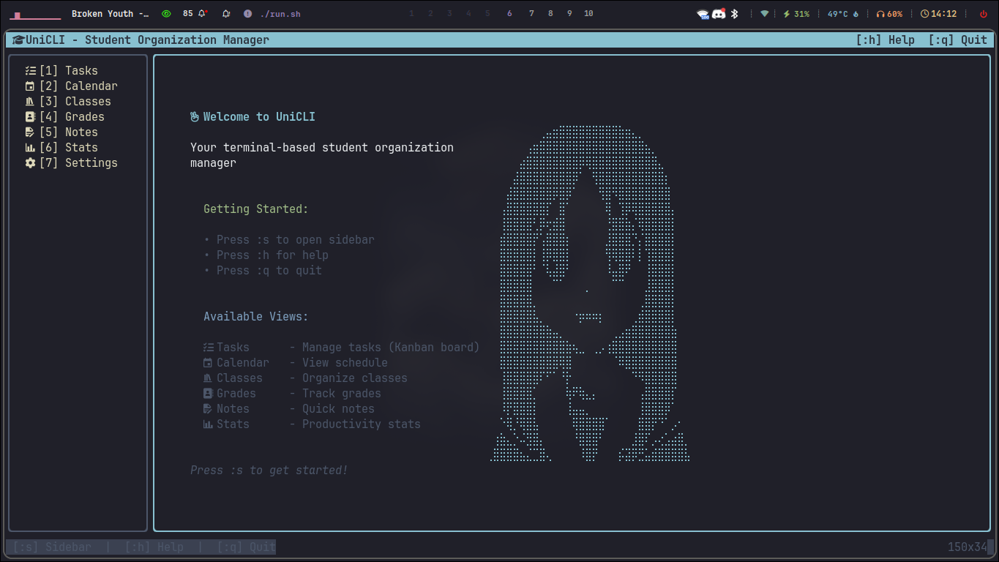
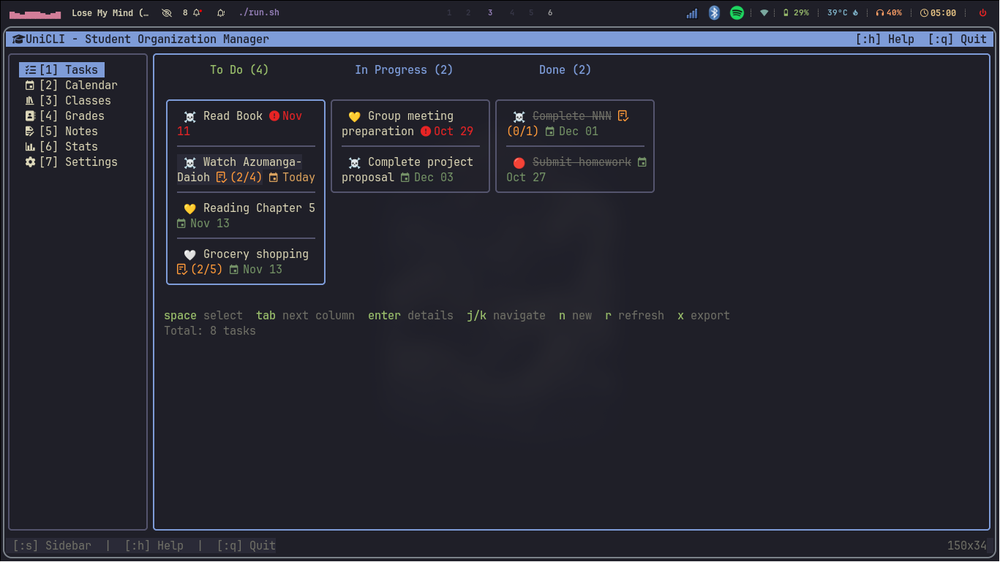
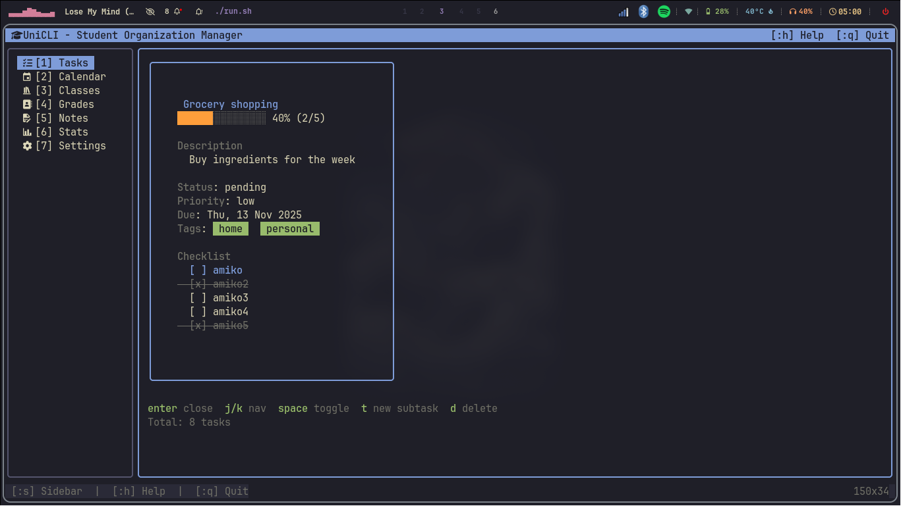
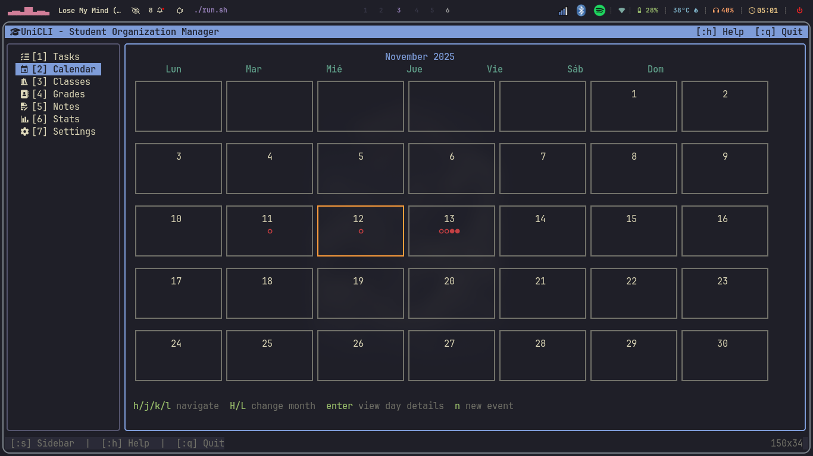

# 🎓 UniCLI - Student Organization TUI

A modern, beautiful Terminal User Interface (TUI) application for student organization and productivity. Built with Go and Bubble Tea.

**Note: This project is currently in active development.**


## ✨ Features

### Core Functionality

- 📋 **Task Management**: Create, edit, and organize tasks with priorities, due dates, and categories.
- 🏷️ **Tags & Subtasks**: Organize tasks with tags and break them down with subtasks.
- 🎒 **Class Management**: Keep track of your classes, professors, and rooms.
- 🗓️ **Class Schedule**: Manage your weekly class schedule.
- 📊 **Grade Tracking**: Record grades for your classes and track your performance.
- 📅 **Events**: Keep track of important events and deadlines.
- 📝 **Notes**: Create and manage notes.

### UI Features

- Beautiful multi-panel interface.
- Intuitive keyboard navigation.
- Customizable color themes.
- Real-time updates.
- Context-sensitive help.

## 🚧 Development Progress

- [x] Task Management
- [x] Tags & Subtasks
- [ ] Class Management
- [ ] Class Schedule
- [ ] Grade Tracking
- [ ] Events
- [ ] Notes


## 🚀 Quick Start

### Installation

```bash
# Clone the repository
git clone https://github.com/stiffis/uni-cli.go.git
cd uni-cli.go

# Build & Run
./run.sh
```

### Requirements

- Go 1.21 or higher
- A terminal with true color support (recommended)

## ⌨️ Keyboard Shortcuts

| Key                    | Action                    |
| ---------------------- | ------------------------- |
| `Tab` / `Shift+Tab`    | Navigate between panels   |
| `j` / `k` or `↓` / `↑` | Navigate up/down in lists |
| `Enter`                | Select/Open item          |
| `n`                    | New item                  |
| `e`                    | Edit item                 |
| `d`                    | Delete item               |
| `Space`                | Toggle complete           |
| `/`                    | Search/Filter             |
| `?`                    | Show help                 |
| `q` or `Ctrl+C`        | Quit                      |

## 📦 Project Structure

```
unicli/
├── cmd/unicli/          # Main application entry point
├── internal/
│   ├── app/            # Application core
│   ├── ui/             # UI components and screens
│   ├── models/         # Data models
│   ├── services/       # Business logic
│   ├── database/       # Database layer (including schema and repositories)
│   └── config/         # Configuration
├── pkg/                # Reusable packages
└── assets/             # Screenshots
```
*User data is stored in `~/.unicli/unicli.db`.*

## 󰚓 ScreenShots






## 🛠️ Development

```bash
# Run in development mode
go run ./cmd/unicli

# Run tests
go test ./...

# Build for production
go build -ldflags="-s -w" -o unicli ./cmd/unicli
```

## 📝 License

MIT License

## 🙏 Acknowledgments

- [Bubble Tea](https://github.com/charmbracelet/bubbletea) - TUI framework
- [Lipgloss](https://github.com/charmbracelet/lipgloss) - Style definitions
- [lazygit](https://github.com/jesseduffield/lazygit) - UI inspiration
