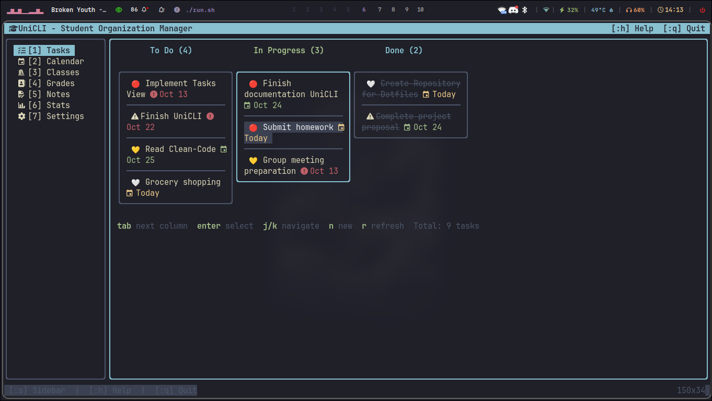

# 🎓 UniCLI - Student Organization TUI

A modern, beautiful Terminal User Interface (TUI) application for student organization and productivity. Built with Go and Bubble Tea.

**Note: This project is currently in active development.**


## ✨ Features

### 📋 Task Management
- Create, edit, and delete tasks with multiple priority levels
- Organize tasks with subtasks for better breakdown
- Category-based organization with custom colors (Kanagawa Wave theme)
- Due date tracking and overdue indicators
- Task completion toggling with visual feedback
- Filter and search capabilities

### 📅 Calendar & Event Management

#### Monthly View
- Beautiful calendar grid with current day highlighting
- Event indicators for each day
- Color-coded events by category
- Quick navigation (j/k or arrow keys)
- Create events directly from any day (press 'c')

#### Weekly View (Time-Blocking)
- Full week timeline view with hourly and half-hourly intervals
- Google Calendar-style time blocking
- Visual event blocks with category colors
- Hour-by-hour cursor navigation
- Create time-blocked events with precise scheduling
- Real-time updates when creating/editing events
- "Now line" showing current time

#### Daily View
- Timeline + statistics split view
- Detailed event timeline for the selected day
- Daily statistics panel showing:
  - 🕐 Total events scheduled
  - ⏱️ Busy time
  - ⏳ Free time
  - 🔴 Due tasks
- List of tasks due on the selected day with priority indicators
- Create, edit, and delete events directly from day view
- "Now line" showing current time
- Priority emojis (🔴 High, 🟡 Medium, 🟢 Low)

### 󱉟 Course Management
- Create and manage courses with detailed information
- Course scheduling with day/time patterns (e.g., "Mon/Wed 10:00-12:00")
- Automatic event generation for course sessions
- Color-coded course events in all calendar views
- Professor and location tracking
- Course credits management
- Integration with calendar for automatic scheduling

### 🏷️ Categories
- Custom category creation and management
- Kanagawa Wave inspired color palette
- Category-based filtering and organization
- Visual color coding throughout the app

### UI Features
- Beautiful multi-panel interface with Kanagawa Wave color scheme
- Intuitive keyboard navigation
- Real-time updates across all views
- Context-sensitive help
- Vim-style command mode (`:`)
- Responsive design adapting to terminal size
- Smooth transitions between views

## 🚧 Development Progress

- [x] Task Management with Subtasks
- [x] Category System with Custom Colors
- [x] Monthly Calendar View
- [x] Weekly Calendar View (Time-Blocking)
- [x] Daily Calendar View with Statistics
- [x] Event Management (Create/Edit/Delete)
- [x] Course Management with Scheduling
- [x] Course Integration with Calendar
- [ ] Grade Tracking
- [ ] Notes System
- [ ] Course Detail View
- [ ] Advanced Statistics


## 🚀 Quick Start

### Installation

```bash
# Clone the repository
git clone https://github.com/stiffis/uni-cli.git
cd uni-cli

# Build & Run
./run.sh

# Or build manually
go build -o unicli ./cmd/unicli
./unicli
```

### Seeding Sample Data

To populate the database with sample data for testing:

```bash
# Run the seed tool
go run ./cmd/seed

# This will create:
# - Sample tasks with subtasks and categories
# - Sample events across different days
# - Sample courses with schedules
# - Categories with Kanagawa Wave colors
```

### Requirements

- Go 1.21 or higher
- A terminal with true color support (recommended)
- Linux, macOS, or WSL on Windows

## ⌨️ Keyboard Shortcuts

### Global Navigation
| Key                    | Action                           |
| ---------------------- | -------------------------------- |
| `1-7`                  | Switch to view (1=Tasks, 2=Calendar, 3=Courses, etc.) |
| `Tab` / `Shift+Tab`    | Navigate between panels          |
| `j` / `k` or `↓` / `↑` | Navigate up/down in lists        |
| `Esc`                  | Go back / Cancel                 |
| `q` or `Ctrl+C`        | Quit                             |
| `?`                    | Show help                        |

### Task Management
| Key                    | Action                           |
| ---------------------- | -------------------------------- |
| `n`                    | New task                         |
| `e`                    | Edit task                        |
| `d`                    | Delete task                      |
| `Space`                | Toggle task completion           |
| `Enter`                | View task details                |

### Calendar Views
| Key                    | Action                           |
| ---------------------- | -------------------------------- |
| `Enter`                | Open day view (from monthly)     |
| `s`                    | Toggle weekly view               |
| `c`                    | Create new event                 |
| `e`                    | Edit selected event              |
| `d`                    | Delete selected event            |
| `h` / `l` or `←` / `→` | Navigate between days/weeks      |
| `j` / `k` or `↓` / `↑` | Navigate hours (in week/day view)|

### Course Management
| Key                    | Action                           |
| ---------------------- | -------------------------------- |
| `n`                    | New course                       |
| `e`                    | Edit course                      |
| `d`                    | Delete course                    |
| `Enter`                | View course details              |

### Forms & Editing
| Key                    | Action                           |
| ---------------------- | -------------------------------- |
| `Ctrl+S`               | Save                             |
| `Esc`                  | Cancel                           |
| `Tab` / `Shift+Tab`    | Navigate form fields             |

## 📦 Project Structure

```
UniCLI/
├── cmd/
│   ├── unicli/          # Main application entry point
│   └── seed/            # Database seeding tool
├── internal/
│   ├── app/             # Application core and routing
│   ├── ui/              # UI components and screens
│   │   ├── components/  # Reusable UI components (forms, inputs)
│   │   ├── screens/     # Main views (tasks, calendar, courses)
│   │   └── styles/      # Kanagawa Wave color theme
│   ├── models/          # Data models (Task, Event, Course, etc.)
│   ├── database/        # Database layer with repositories
│   └── config/          # Configuration management
├── assets/              # Screenshots and media
├── docs/                # Documentation
└── pkg/                 # Reusable packages
```

**User data is stored in `~/.unicli/unicli.db` (SQLite database)**

## 🎨 Color Theme

UniCLI uses the beautiful **Kanagawa Wave** color palette from Neovim, providing a harmonious and easy-on-the-eyes interface:

- **Categories**: #C34043 (red), #76946A (green), #C8C093 (beige), #957FB8 (purple), #7AA89F (teal)
- **Accent colors**: Adapted from Kanagawa Wave's syntax highlighting
- **Background**: Deep, calm tones for comfortable long-term usage

## 󰚓 Screenshots


*Welcome screen with quick navigation*


*Task list with categories, priorities, and subtasks*


*Detailed task view with all information*


*Monthly calendar with event indicators*

## 🛠️ Development

```bash
# Run in development mode
go run ./cmd/unicli

# Run with sample data
go run ./cmd/seed && go run ./cmd/unicli

# Run tests
go test ./...

# Build for production
go build -ldflags="-s -w" -o unicli ./cmd/unicli
```

## 🗺️ Roadmap

### Short Term
- [ ] Course detail view with assignments and materials
- [ ] Enhanced statistics and analytics
- [ ] Task filtering and advanced search
- [ ] Export/Import functionality

### Long Term
- [ ] Grade tracking and GPA calculation
- [ ] Notes system with markdown support
- [ ] Pomodoro timer integration
- [ ] Cloud sync capabilities
- [ ] Mobile companion app

## 🤝 Contributing

Contributions are welcome! Please feel free to submit a Pull Request.

1. Fork the repository
2. Create your feature branch (`git checkout -b feature/AmazingFeature`)
3. Commit your changes (`git commit -m 'Add some AmazingFeature'`)
4. Push to the branch (`git push origin feature/AmazingFeature`)
5. Open a Pull Request

## 📝 License

MIT License - see LICENSE file for details

## 🙏 Acknowledgments

- [Bubble Tea](https://github.com/charmbracelet/bubbletea) - The foundation of our TUI
- [Lipgloss](https://github.com/charmbracelet/lipgloss) - Beautiful style definitions
- [Kanagawa.nvim](https://github.com/rebelot/kanagawa.nvim) - Color palette inspiration
- [lazygit](https://github.com/jesseduffield/lazygit) - UI/UX inspiration

## 📧 Contact

For questions, suggestions, or issues, please open an issue on GitHub.

---

Made with ❤️ for students who love the terminal
